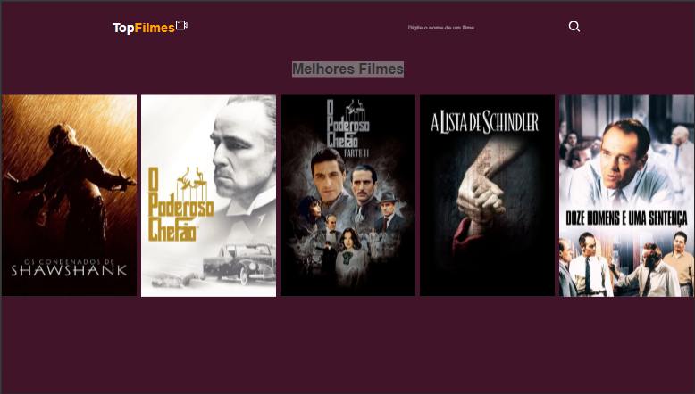

# 🎬 TopMovies

O **TopMovies** é uma aplicação web criada com **React.js + Vite** que permite ao usuário buscar e visualizar informações sobre filmes de forma rápida e intuitiva. O projeto utiliza a **API do IMDb** para exibir os filmes mais populares.

  

---

## 🚀 Funcionalidades

- 🔍 **Busca de filmes** por título
- 🎞️ **Exibição de detalhes** individuais de cada filme
- 🏆 Listagem dos filmes mais populares
- 🧭 **Navegação com React Router**
- ⚠️ Página de erro personalizada (`404`)
- ⚙️ **Variáveis de ambiente** com `.env` para esconder a chave da API

---

## 📦 Tecnologias utilizadas

- [React.js](https://reactjs.org/)
- [React Router DOM](https://reactrouter.com/)
- [Vite](https://vitejs.dev/)
- [IMDb API](https://rapidapi.com/apidojo/api/imdb8/)
- [CSS Modules](https://github.com/css-modules/css-modules)
- [.env](https://vitejs.dev/guide/env-and-mode.html)

---

## 🗂️ Estrutura do Projeto
```
src/
├── components/
│ ├── Footer.jsx
│ ├── Footer.css
│ └── Navbar.jsx
│ └── Navbar.css
├── pages/
│ ├── Home.jsx
│ ├── Home.css
│ ├── Search.jsx
│ ├── Search.css
│ ├── SingleMovie.jsx
│ ├── SingleMovie.css
│ ├── ErrorPage.jsx
│ └── ErrorPage.css
├── App.jsx
├── App.css
├── index.css
└── main.jsx
.env
.vite.config.js
.eslintrc.cjs
index.html
package.json
```


---

## 🧪 Como executar o projeto localmente

### 1. Clone o repositório

```bash
git clone https://github.com/KevinBaudson/topmovies.git
cd topmovies
```
### 2. Instale as dependências
bash
Copiar
Editar
npm install
### 3. Crie um arquivo .env na raiz do projeto
env
Copiar
Editar
VITE_API_KEY=sua_chave_aqui
🔐 Você pode obter uma chave gratuita da IMDb API via RapidAPI
### 4. Rode o projeto
bash
Copiar
Editar
npm run dev
🔗 Deploy
 [TopMovies](https://topmovies-lake.vercel.app/)

## 🧠 Aprendizados

Este projeto me ajudou a praticar:

- ✅ Criação de rotas com **React Router**
- ✅ Integração com **API externa** utilizando variáveis de ambiente com `.env`
- ✅ Aplicação de **boas práticas na estruturação de componentes**
- ✅ Uso de **estilização modularizada e reutilizável** com **CSS Modules**
- ✅ Implementação de **tratamento de erros** com uma **página 404 personalizada** em SPA (Single Page Application)


## 📫 Contato

📧 Email: kevinbaudson@gmail.com

💼 [LinkedIn](https://www.linkedin.com/in/kevin-baudson-8aba0a256/)

📱 [WhatsApp](https://api.whatsapp.com/send/?phone=5528999453325)


